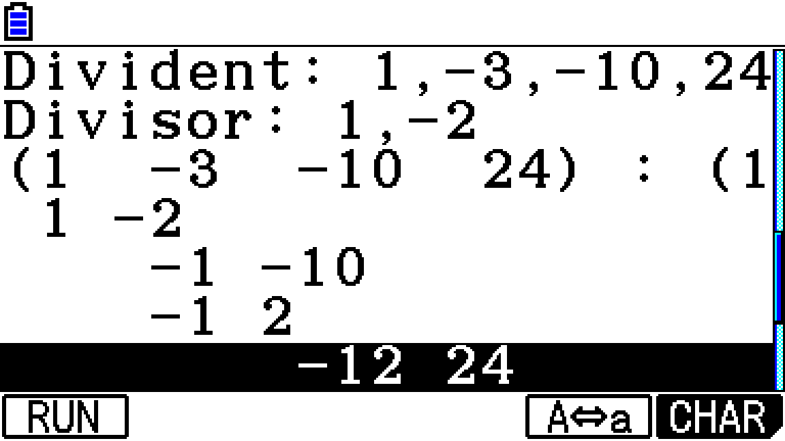

# Polynomdivisionsrechner für Casio CG50



---

Der Poynomdivisionsrechner ist ein Pythonscript, dass 
für die Nutzung auf einem Python-fähigen Taschenrechner
wie den Casio CG50 optimiert ist. Er errechnet den Polynomqoutienten
mit Rest und gibt dabei den Lösungsweg an.

---
## Beispiel

```
Divident: 1,5,6
Divisor: 1,2
(1  5  6) : (1  2)
 1 2
    3 6
    3 6

Ergebnis:   [1, 3]
Rest:       [0]
```

---

## Dokumentation

Siehe [Docstring](./polynomdivision.py).